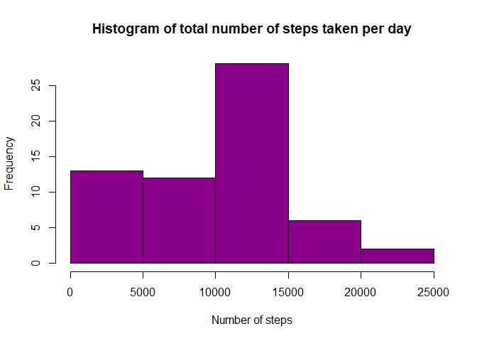

## Loading and preprocessing the data
In order to have a look at the data, we first have to unzip it and load it:

```r
unzip("activity.zip", exdir = ".")
activity <- read.csv("activity.csv",header = TRUE)
```

In order to be able to process the data further, we first need to transform the data into a suitable format:

```r
# Create an empty vector with length = amount of days present in dataset
daysum <- vector(mode="numeric",length=length(unique(activity$date)))

# For each date, calculate the sum of all steps taken that day, ignoring NAs
for(i in 1:length(unique(activity$date))){
    daysum[i] <- sum(activity$steps[activity$date==unique(activity$date)[i]], na.rm=TRUE)
}
```


## What is the mean total number of steps taken per day?

Here we'll create a histogram of the total number of steps taken each day


```r
hist(daysum, main="Histogram of total number of steps taken per day",
     xlab="Number of steps", ylab="Frequency",
     col="darkmagenta")
```

<!-- -->

We will now calculate the **mean** and **median** total number of steps taken per day:

```r
meansteps <- mean(daysum)
mediansteps <- median(daysum)
```

The mean amount of steps taken per day is 9354.2295082, the median is 1.0395\times 10^{4}

## What is the average daily activity pattern?


## Imputing missing values


## Are there differences in activity patterns between weekdays and weekends?
